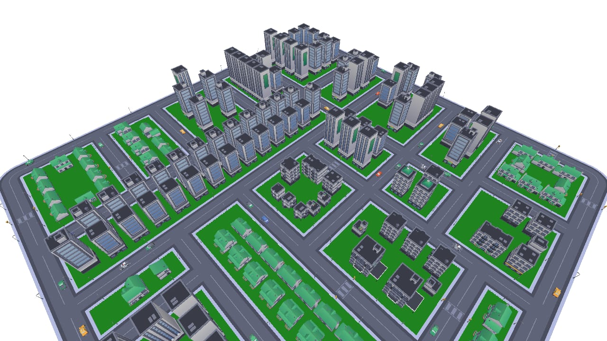
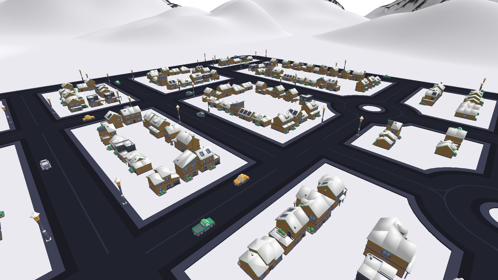
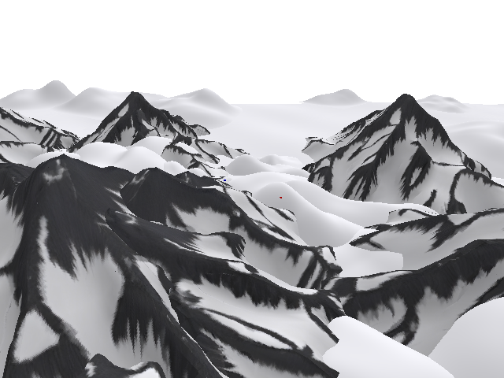
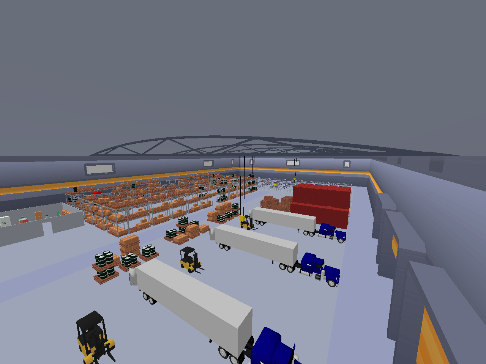
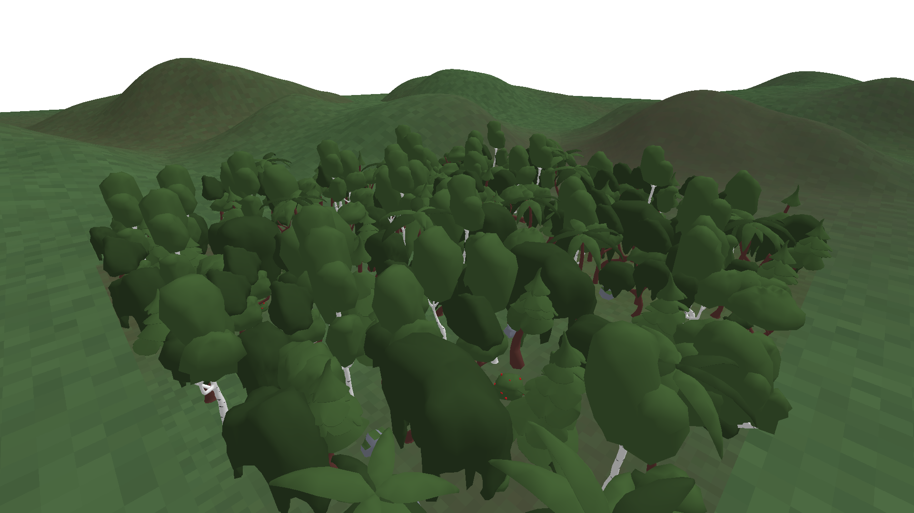
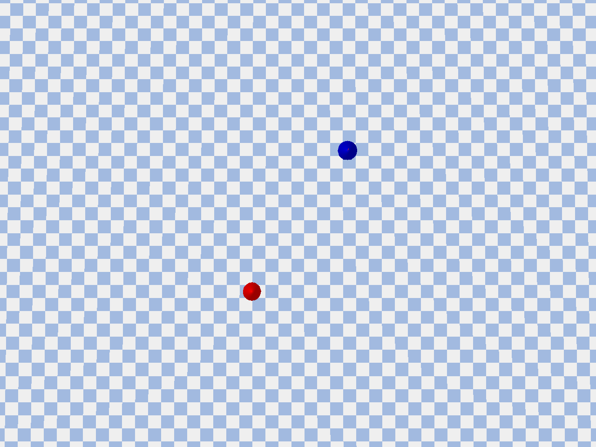
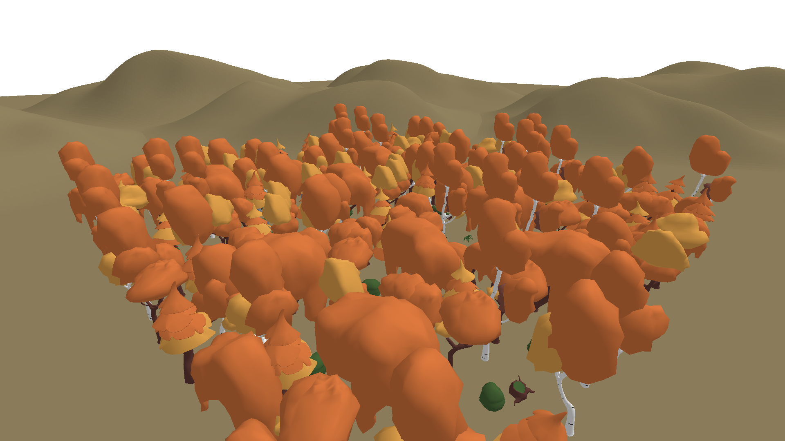
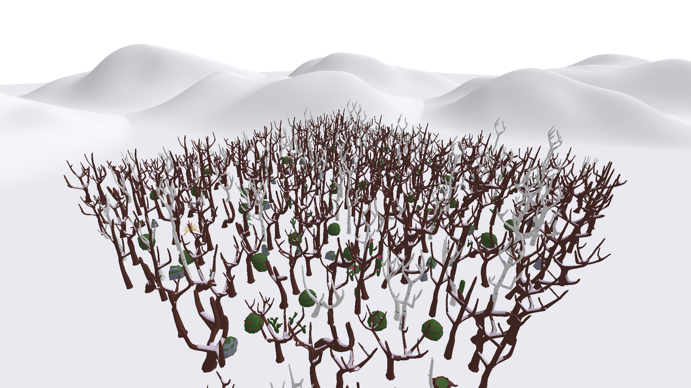
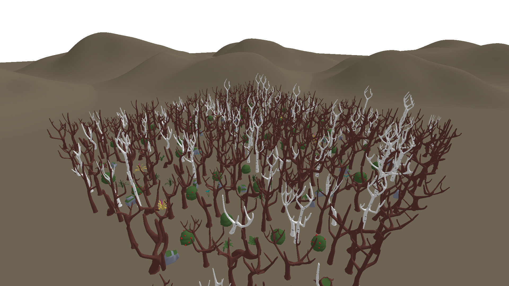

<a id="readme-top"></a>

<p align="center">
  
</p>

<h1 align="center">Swarm Worlds</h1>

<p align="center">
  <b>Every world a Swarm drone flies through, in one place.</b><br/>
  <i>The maps, the robot descriptions and the textures the simulator loads, released by tag.</i>
</p>

<p align="center">
  <a href="https://discord.gg/8dPqPDw7GC"></a>
  <a href="https://x.com/SwarmSubnet"></a>
  <a href="https://swarm124.com"></a>
</p>

<p align="center">
  <a href="https://github.com/swarm-subnet/swarm"></a>
  &nbsp;
  <a href="https://github.com/swarm-subnet/swarm/blob/main/miner/docs/miner.md"></a>
</p>

---

<!-- ABOUT -->
## What Is This Repository

[Swarm](https://swarm124.com) is Bittensor subnet 124: an open arena where anyone can train a drone
pilot and prove it against the world. The worlds it flies through are built from the files in this
repository: the building kits, trees, furniture, vehicles and people the generators place, the two
drone descriptions, and the textures the map builders apply.

This repository holds files, not code. The generators that turn a seed into a world live in the
[swarm](https://github.com/swarm-subnet/swarm) repository and install this one as a Python package,
pinned to a release tag. A new tag is a new release of the worlds.

<p align="right">(<a href="#readme-top">back to top</a>)</p>

---

<!-- WORLDS -->
## The Worlds

None of these worlds exist until the benchmark builds them. The seed decides the layout; the files
here decide what it is built from.

<table>
<tr>
<td align="center" width="33%">

<br><b>City</b><br><sub>streets, buildings, intersections</sub>
</td>
<td align="center" width="33%">

<br><b>Ski Village</b><br><sub>snow-roofed streets, mountains</sub>
</td>
<td align="center" width="33%">

<br><b>Mountains</b><br><sub>peaks and valleys</sub>
</td>
</tr>
<tr>
<td align="center" width="33%">

<br><b>Warehouse</b><br><sub>indoor racks and cranes</sub>
</td>
<td align="center" width="33%">

<br><b>Forest</b><br><sub>dense trees, tight gaps</sub>
</td>
<td align="center" width="33%">

<br><b>Open terrain</b><br><sub>wide skies, no cover</sub>
</td>
</tr>
</table>

<h4 align="center">Forest, in four seasons</h4>

<table>
<tr>
<td align="center" width="25%"><br><sub><b>Normal</b></sub></td>
<td align="center" width="25%"><br><sub><b>Autumn</b></sub></td>
<td align="center" width="25%"><br><sub><b>Snow</b></sub></td>
<td align="center" width="25%"><br><sub><b>Dead</b></sub></td>
</tr>
</table>

| World | Built from |
|-------|-----------|
| **City** | `kenney/kenney_suburban`, `kenney/kenney_commercial`, `kenney/kenney_roads`, `kenney/kenney_car-kit` |
| **Ski Village** and **Mountains** | `custom/mountains`, `custom/buildings`, `kenney/holiday`, the road and car kits |
| **Warehouse** | `custom/warehouse_shell`, `kenney/kenney_conveyor-kit`, `kenney/kenney_furniture-kit`, `other_sources` |
| **Forest** | `forest/quaternius_ultimate_nature`, `forest/textures` |
| **Open terrain** | generated from the seed; the landing pad texture in `textures/` |
| **Office** | `custom/office`, the baked digital twin with its pieces manifest |
| **Search and Rescue targets** | `custom/people`, 32 lost-person characters and the mannequin |

<p align="right">(<a href="#readme-top">back to top</a>)</p>

---

<!-- LAYOUT -->
## Layout

```
swarm_worlds/
  maps/
    custom/          project-made assets: office twin, mountains, buildings, warehouse shell, lost-person characters
    forest/          Quaternius nature packs and the forest ground texture
    kenney/          Kenney kits: suburban, commercial, roads, car, conveyor, furniture, holiday
    other_sources/   third-party assets kept under their original licenses
  robots/            tello.urdf with its mesh folder, interceptor_drone.urdf
  textures/          tao.png (landing pad), Swarm.png and Swarm_2.png (wall posters)
docs/img/            the pictures on this page
tests/               checks that every root, manifest entry, URDF and material library resolves
```

Every folder keeps the license and source notice of the pack it came from. `maps/README.md` and
`maps/custom/LICENSE_CUSTOM_MAPS.md` describe the origin of each group.

<p align="right">(<a href="#readme-top">back to top</a>)</p>

---

<!-- USING -->
## Using It

```python
import swarm_worlds

swarm_worlds.maps_dir()      # .../swarm_worlds/maps
swarm_worlds.robots_dir()    # .../swarm_worlds/robots
swarm_worlds.textures_dir()  # .../swarm_worlds/textures
```

Each function returns an absolute path. Assets are addressed by their relative name below that
root, for example `kenney/kenney_suburban/building-type-a.obj`.

The swarm repository pins a tagged release in its `requirements.txt`:

```
swarm-worlds @ git+https://github.com/swarm-subnet/swarm-worlds.git@v1.0.0
```

pip, uv and pixi all install that line. The simulator writes small caches next to some assets at
runtime, so the package must be installed somewhere the running user can write, which is the case
for a virtualenv or a pixi environment owned by that user.

<p align="right">(<a href="#readme-top">back to top</a>)</p>

---

<!-- CHANGING -->
## Changing an Asset

1. Open a pull request here. CI installs the built wheel and checks that every root, manifest
   entry, URDF and material library resolves.
2. Bump `__version__` in `swarm_worlds/__init__.py` and tag the merge commit with the same number
   (`v1.1.0`).
3. Bump the tag in the swarm repository's `requirements.txt`, refresh its `pixi.lock`, and bump the
   swarm version. A map change can change flight results, so it follows the same release rules as a
   scoring change.

```bash
python -m venv .venv && source .venv/bin/activate
pip install -e . pytest pre-commit
pytest
pre-commit run --all-files
```

<p align="right">(<a href="#readme-top">back to top</a>)</p>

---

<!-- LICENSE -->
## License

The package is distributed under the MIT License, see [LICENSE](LICENSE). Each asset pack keeps
its own license where it sits; `maps/README.md` points at every notice.
